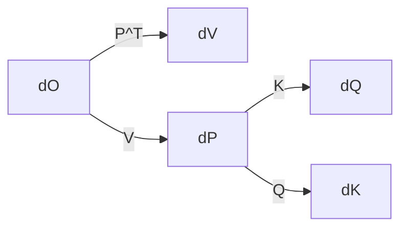

# Flash Attention Backward Pass: Triton Implementation Guide

This document explains the Triton implementation details for the backward pass of Flash Attention, focusing on gradient computation for `dQ`, `dK`, and `dV`. It synthesizes code analysis, mathematical derivations, and performance optimizations.

---

## 1. Key Mathematical Relationships
### Mathematical Formulae Table

| Gradient         | Formula                                | Code Equivalent                     |
|------------------|----------------------------------------|-------------------------------------|
| $\frac{\partial \phi}{\partial V}$ | $P^T \frac{\partial \phi}{\partial O}$ | `dV_block += tl.dot(P_T_block, dO_block)` |
| $\frac{\partial \phi}{\partial P}$ | $\frac{\partial \phi}{\partial O} V^T$ | `dP_block = tl.dot(dO_block, V_T_block)` |
| $\frac{\partial \phi}{\partial Q}$ | $\mathrm{softmax\_scale} \cdot dS \cdot K$ | `dQ_block += softmax_scale * tl.dot(dS_block, K_T)` |

### Matrix Dimensions
| Tensor | Shape               | Example (SEQ_LEN=4, HEAD_DIM=2) |
|--------|---------------------|----------------------------------|
| Q/K/V  | [B, H, SEQ_LEN, D]  | [1, 1, 4, 2]                     |
| O      | [B, H, SEQ_LEN, D]  | Same as Q                        |
| dO     | [B, H, SEQ_LEN, D]  | Same as Q                        |

---

## 2. Core Implementation Details
### 2.1 Memory Layout & Pointer Arithmetic
**Tensor Strides** (for contiguous tensors):
```python
stride_batch = H * SEQ_LEN * HEAD_DIM
stride_head = SEQ_LEN * HEAD_DIM
stride_seq = HEAD_DIM
stride_dim = 1
```

**Pointer Adjustment**:
```python
# Batch/head offset calculation
offset_batch_head = (stride_batch * index_batch 
                   + stride_head * index_head)

# Code from image.png:
Q += offset_batch_head  # Points to [batch, head, 0:SEQ_LEN, 0:HEAD_DIM]
K += offset_batch_head
V += offset_batch_head
```

### 2.2 Block Indexing Strategy
#### Program ID Mapping
| Kernel               | `program_id(0)`          | `program_id(2)`         |
|----------------------|--------------------------|-------------------------|
| `_attn_bwd_preprocess` | Sequence block (Q)       | Batch-head index        |
| `_attn_bwd_dq`        | Sequence block (Q)       | Batch-head index        |
| `_attn_bwd_dk_dv`     | Sequence block (K/V)     | Batch-head index        |

**Example Workflow** (SEQ_LEN=4, BLOCK_Q=2):
```python
# For program_id(0)=0 in _attn_bwd_dq:
offs_q = [0, 1]  # Processes Q[0:2]
offs_kv = tl.arange(0, BLOCK_KV)  # [0,1] then [2,3]
```

### 2.3 Critical Code Snippets Explained
#### From image.png (K/V Loading):
```python
# Load K block for gradient computation
k_block = tl.load(
    K + offs_kv[:, None] * stride_seq   # Sequence dimension
    + offs_dim[None, :] * stride_dim    # Head dimension
)
# Equivalent to K[offs_kv, :] in NumPy
# Shape: (BLOCK_KV, HEAD_DIM)
```

#### Gradient Accumulation:
```python
# dV computation (image.png equations)
dV_block += tl.dot(P_T_block.to(tl.float16), dO_block)
# Matches dV = P^T dO from math equations
```

---

## 3. Performance Optimizations
### 3.1 Kernel Grid Strategy
```python
# Typical grid configuration
grid = (
    triton.cdiv(SEQ_LEN, BLOCK_Q),  # program_id(0)
    BATCH_SIZE * NUM_HEADS,         # program_id(1/2)
    1
)
```

### 3.2 Memory Management
1. **SRAM Blocking**:
   - K/V blocks remain in SRAM during inner loops
   - Q blocks streamed from global memory
2. **Recomputation**:
   - Attention matrix `P` recalculated during backward pass
   - Avoids storing $O(N^2)$ intermediate values

### 3.3 Autotuning & Pipelining
| Technique          | Description                          | Code Example                    |
|--------------------|--------------------------------------|---------------------------------|
| Software Pipelining | Overlap memory ops with computations | `async_load -> compute -> async_store` |
| Autotune           | Tests block sizes {16, 32, 64, 128}  | `triton.Config({'BLOCK_Q': 64}, ...)` |

---

## 4. Implementation Checklist
### Critical Indexing Patterns
1. **Sequence Dimension**:
   ```python
   offs_q = start_q + tl.arange(0, BLOCK_Q)
   # start_q = program_id(0) * BLOCK_Q
   ```
2. **Head Dimension**:
   ```python
   offs_dim = tl.arange(0, HEAD_DIM)  # [0, 1,...,D-1]
   ```

### Masking Logic (Causal Attention)
```python
# Forward direction mask
mask = offs_q[:, None] >= offs_kv[None, :]

# Backward gradient mask
mask = offs_kv[:, None] >= offs_q[None, :]
```

---

## 5. Common Pitfalls & Solutions
| Issue                      | Symptom                           | Fix                                  |
|----------------------------|-----------------------------------|--------------------------------------|
| Misaligned strides         | Garbage gradient values          | Verify tensor.is_contiguous()        |
| Incorrect program_id mapping | Partial gradient computation     | Check grid() dimensions vs kernel args |
| Mask direction reversed     | Non-causal gradients in causal mode | Flip `>=` to `<=` in dk_dv kernel   |

---

## 6. Debugging Toolkit
### Essential Prints
```python
# Inside any kernel:
tl.device_print("Q block indices:", offs_q)
tl.device_print("K block shape:", tl.shape(K_block))
```

### Validation Test
```python
# Small test case (SEQ_LEN=2)
Q = torch.tensor([[[[0.1, 0.2], [0.3, 0.4]]]], device='cuda')
# Manually compute expected gradients
# Compare with Triton output
```

---

## 7. Visual Guide
### Memory Layout for Q Tensor
```
Batch 0 ───► Head 0 ───► Seq 0 ───► [dim0, dim1]
                      └─► Seq 1 ───► [dim0, dim1]
```
Pointer arithmetic jumps `stride_seq = HEAD_DIM` elements between sequence positions.

### Gradient Data Flow


---

## 8. Further Reading
1. **Triton Docs**: [Block Pointer API](https://triton-lang.org/main/python-api/generated/triton.language.make_block_ptr.html)
2. **Flash Attention Paper**: [Algorithm 2](https://arxiv.org/abs/2205.14135)
3. **Performance Tuning**: Triton's `autotune` decorator parameters

```python
# Example autotune config
@triton.autotune(
    configs=[
        triton.Config({'BLOCK_Q': 32}, num_warps=2),
        triton.Config({'BLOCK_Q': 64}, num_warps=4),
    ],
    key=['SEQ_LEN']
)
```
